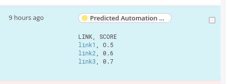
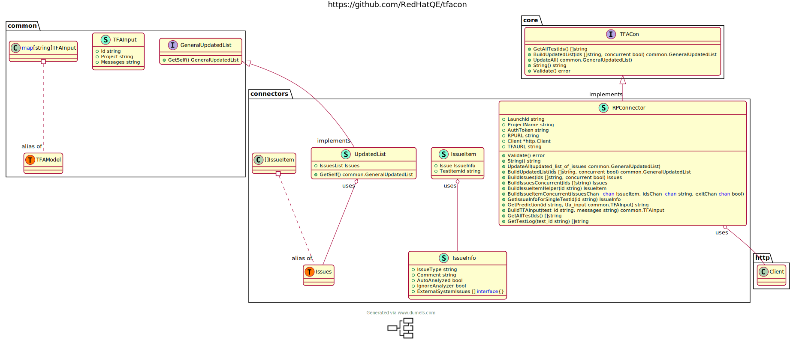

# Test Failure Classifier Connector 

## Description
__tfacon__ is a CLI tool for connecting Test Management Platforms and __Test Failure Analysis Classifier__. __Test Failure Analysis Classifier__ is
an AI/ML predictioner developed by *Red Hat D&O Data Science Team* which can predict the test's catalog. It supports __AutomationBug, ProductBug, SystemBug__ on Report Portal now. tfacon only support report portal at this moment. We will support more platforms in the future.

## User Guide
### Installation and Upgrade
You can install a new version of tfacon using below commands
##### Via go get
```bash
go get -u github.com/RedHatQE/tfacon@master
```
##### Via pip
```bash
pip install tfacon
```
### Get Started

#### tfacon.yml
This is where you store all parameters like this
__You must use auth_token from a superadmin account to run tfacon, otherwise the validation will fail!__
```yaml
launch_id: "your launch_id goes here"
launch_name: "This is optional if you have launch id"
launch_uuid: "This is optional if you have launch id"
project_name: "your project name goes here in lower case"
team_name: "you team name, this will only be used by tfar"
auth_token: "xxxxx-xxxx-xxxxx-xxxx-xxxxx"
platform_url: "https://reportportal.com"
tfa_url: "your tfa classifier url"
re_url: "your tfa recommendation engine url"
connector_type: "RPCon"
```
The default name is tfacon.yml, you can change this by edit this environment variable __TFACON_YAML_PATH__ 

#### tfacon.cfg
This is where you put all the config information for tfacon
```ini
[config]
# This will run prediction extraction concurrently
concurrency=True
# tfacon will add attributes of "AI Prediction" and "Accuracy" under the item details section
add_attributes=False
# you can define the retry number here
retry_times = 20
# you can define if you want to enable the auto_finalize_defect_type feature
auto_finalize_defect_type = True
# You need to specify this parameter to have TFA automatically tag the test item to the defect types without Pridicted
auto_finalization_thredshold = 0.999
```
The default name for this cfg file is tfacon.cfg, you can change this by edit this environment variable __TFACON_CONFIG_PATH__

#### list
```bash
❯ tfacon list -h
list all information constructed from tfacon.yml/environment variables/cli

Usage:
  tfacon list [flags]

Flags:
      --auth-token string       The AUTH_TOKEN of report portal
      --connector-type string   The type of connector you want to use (example: RPCon, PolarionCon, JiraCon) (default "RPCon")
  -h, --help                    help for list
      --launch-id string        The launch id of report portal
      --launch-name string      The launch name of the launch in report portal
      --launch-uuid string      The launch uuid of report portal
      --platform-url string     The url to the test platform (example: https://reportportal-<your_domain>.com) (default "default value for platform url")
      --project-name string     The project name of report portal
      --re-url string           The url to the Recommendation Engine (default "default value for Recommendation Engine url")
      --tfa-url string          The url to the TFA Classifier (default "default value for tfa url")

Global Flags:
  -r, --re        You can add this tag to let tfacon add Recommendation Engine result to comment section
  -v, --verbose   You can add this tag to print more detailed info
```

Output Example:
```bash
❯ tfacon list
--------------------------------------------------
tfacon  1.1.4
Copyright (C) 2023, Red Hat, Inc.
-------------------------------------------------


2023/08/06 03:21:33 Printing the constructed information
LaunchID:        968
ProjectName:     tfa_rp_test
AuthToken:       xxxx-xxxx-xxxxxxx-xxxxxx-xxxxxxxxx
RPURL:           https://reportportal-<your_domain>.com
Client:          &{<nil> <nil> <nil> 0s}
TeamName:        your-team-name
TFAURL:          https://<tfa_team_domain>.com
LaunchID:        28
LaunchUUID:      32348
LaunchName:      "launch_name"
REURL:   https://dave.corp.redhat.com:443/models/61b8d1acfa9c3f1c2fd2c914/latest/model
```
#### run
```bash
❯ tfacon run -h 
run the info retrival and get the prediction from TFA

Usage:
  tfacon run [flags]

Flags:
      --auth-token string       The AUTH_TOKEN of report portal
      --connector-type string   The type of connector you want to use(example: RPCon, PolarionCon, JiraCon) (default "RPCon")
  -h, --help                    help for run
      --launch-id string        The launch id of report portal
      --team-name string        your team name
      --launch-name string      The launch name of the launch in report portal
      --platform-url string     The url to the test platform (example: https://reportportal-<your_domain>.com) (default "default value for platform url")
      --project-name string     The project name of report portal
      --re-url string           The url to the Recommendation Engine (default "default value for Recommendation Engine url")
      --tfa-url string          The url to the TFA Classifier (default "default value for tfa url")

Global Flags:
  -r, --re        You can add this tag to let tfacon add Recommendation Engine result to comment section
  -v, --verbose   You can add this tag to print more detailed info
```

Example Output
```bash
❯ tfacon run --project-name "project_name" --launch-id 1006

2021/08/06 03:46:59 Getting prediction of test item(id): 54799
2021/08/06 03:46:59 Getting prediction of test item(id): 54900
2021/08/06 03:46:59 Getting prediction of test item(id): 54106
2021/08/06 03:46:59 Getting prediction of test item(id): 54555
2021/08/06 03:46:59 Getting prediction of test item(id): 54986
2021/08/06 03:46:59 Getting prediction of test item(id): 54411
2021/08/06 03:46:59 Getting prediction of test item(id): 54824
2021/08/06 03:46:59 Getting prediction of test item(id): 54642
2021/08/06 03:46:59 Getting prediction of test item(id): 54841
This is the return info from update: [{"issueType":"ab001","comment":"","autoAnalyzed":false,"ignoreAnalyzer":false,"externalSystemIssues":[]},{"issueType":"ab001","comment":"","autoAnalyzed":false,"ignoreAnalyzer":false,"externalSystemIssues":[]},{"issueType":"ab001","comment":"Should be marked with custom defect type","autoAnalyzed":false,"ignoreAnalyzer":false,"externalSystemIssues":[]},{"issueType":"si001","comment":"","autoAnalyzed":false,"ignoreAnalyzer":false,"externalSystemIssues":[]},{"issueType":"ab001","comment":"Should be marked with custom defect type","autoAnalyzed":false,"ignoreAnalyzer":false,"externalSystemIssues":[]},{"issueType":"ab001","comment":"Should be marked with custom defect type","autoAnalyzed":false,"ignoreAnalyzer":false,"externalSystemIssues":[]},{"issueType":"ab001","comment":"Should be marked with custom defect type","autoAnalyzed":false,"ignoreAnalyzer":false,"externalSystemIssues":[]},{"issueType":"ab001","comment":"Should be marked with custom defect type","autoAnalyzed":false,"ignoreAnalyzer":false,"externalSystemIssues":[]},{"issueType":"pb001","comment":"Should be marked with custom defect type","autoAnalyzed":false,"ignoreAnalyzer":false,"externalSystemIssues":[]}]
```

Example Comment on Report Portal



#### validate
__You must use auth_token from a superadmin account to run tfacon, otherwise the validation will fail!__
```bash
❯ tfacon validate -h
validate if the parameter is valid and if the urls are accessible

Usage:
  tfacon validate [flags]

Flags:
      --auth-token string       The AUTH_TOKEN of report portal
      --connector-type string   The type of connector you want to use(example: RPCon, PolarionCon, JiraCon) (default "RPCon")
  -h, --help                    help for validate
      --launch-id string        The launch id of report portal
      --platform-url string     The url to the test platform (example: https://reportportal-<your_domain>.com) (default "default value for platform url")
      --project-name string     The project name of report portal
      --tfa-url string          The url to the TFA Classifier (default "default value for tfa url")

Global Flags:
  -v, --verbose   You can add this tag to print more detailed info
```

Example Output
```bash
❯ tfacon validate --project-name "TFACON-Test" --launch-id 231
LaunchID:        231
ProjectName:     TFACON-Test
AuthToken:       xxxxxxxxxxx-xxxx-xxxx-xxxx-xxxxxxxx
RPURL:           https://reportportal-<your_domain>.com
Client:          &{<nil> <nil> <nil> 0s}
TFAURL:          https://<tfa_team_domain>/latest/model

Validation Passed!
```
You can also add -v to have more detailed information for validation error
#### init
```bash
❯ tfacon init -h                                     
init will create a sample workspace for tfacon

Usage:
  tfacon init [flags]

Flags:
  -h, --help   help for init

Global Flags:
  -v, --verbose   You can add this tag to print more detailed info
```


### Advanced Config
__You can set up advanced config in ./tfacon.cfg by default or you can define the location of the config file with TFACON_CONFIG_PATH environment variable__

Example
```ini
[config]
concurrency=True
add_attributes=true
```

#### Set Concurrency
__You can set this to True or False, if you set it to True tfacon will deal with the test items in a faster async non-blocking way, you can disable it to have a clearer view, but you will have a slower run compared to setting it to True__

#### add_attributes
__You can enable this to add extra attribute "AI Prediction" and "Prediction Score"
to all the test items, the value of this attribute will be the prediction extracted
from TFA Classifier__


## Developer Guide
### Architecture
#### UML graph


## Contributor Guide
### Branch name
__*develop*__ is the development branch
__*master*__ is the stable branch

### More Details
#### Release Information
[v1.0.0](https://github.com/RedHatQE/tfacon/releases/tag/v1.0.0)
#### [Video Tutorial](https://www.youtube.com/playlist?list=PLbY6iJAZIsCD6ed_k18wW8dtw4m8x7hlj)
#### How To Embed tfacon to CI Pipelines
[CI Details](docs/more_docs/CI.md)
